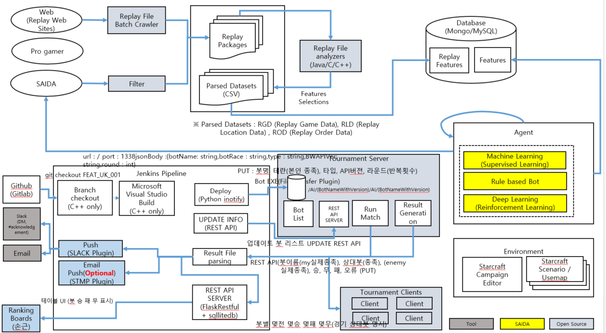
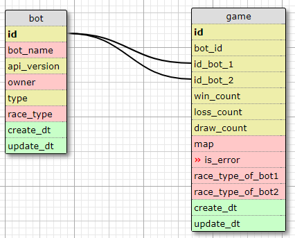

# Saida Data Framework Server
사이다팀에서 사용되는 봇과 토너먼트 이력 정보를 관리하는 서버

## Pre Requisite
구분  | 프로그램  | 버젼  | 설명  
--|---|---|--
1   | Python   | 3.5  |   requirements.txt 참고
2  | flaskRESTful  |   | requirements.txt 참고  
3   | pymysql  |   |  
4   | Microsoft visual studio | 2013 edition   |  
5  | MySQL | 5.5.59.0 community version     |  

### MySQL 설정
Server mode로만 설치
3306 기본포트
saida / saida
리모트 연결 접속 허용을 위해 아래 커맨드 실행 필요(초기 셋업시) 링크
grant all privileges on saida.* to 'saida'@"%" identified by 'saida' with grant option;
flush privlileges;

### Mysql 접속정보


구분  | 속성  | 값   | 설명  |  
--|---|---|---|--
  1 | host   |  192.168.0.23  |   |  
  2 | name   |  saida |   |  
  3 | user   |  saida |   |  
  4 | password  | saida  |   |    
  5 | database-name  | saida  |   |  
  6 | init-script   | \\materials\\create-table.sql  |   |  
  7 | init-script   | \\materials\\insert-table.sql  |   |  

### SQL script
```{sql}
-- ---
-- Globals
-- ---

-- SET SQL_MODE="NO_AUTO_VALUE_ON_ZERO";
-- SET FOREIGN_KEY_CHECKS=0;

-- ---
-- Table 'code'
-- 코드 정보
-- ---
DROP TABLE IF EXISTS code;

CREATE TABLE code (
  `code_id` VARCHAR(30) NOT NULL,
  `code_val` CHAR(2) NOT NULL,
  `code_desc` VARCHAR(100) NOT NULL,
  PRIMARY KEY (`code_id`, `code_val`)
) COMMENT '코드 정보';

-- ---
-- Table 'game'
-- 대전 경기 이력정보
-- ---
DROP TABLE IF EXISTS `game`;

CREATE TABLE `game` (
  `turn` INTEGER NOT NULL,
  `game_id` INTEGER NOT NULL,
  `bot_id_1` INTEGER NOT NULL,
  `bot_id_2` INTEGER NOT NULL,
  `race_cd_1` CHAR(2) NOT NULL DEFAULT '04',
  `race_cd_2` CHAR(2) NOT NULL DEFAULT '04',
  `rslt_cd` CHAR(2) NOT NULL,
  `map_cd` CHAR(2) NOT NULL,
  `create_dt` DATETIME NULL DEFAULT NULL,
  `update_dt` DATETIME NULL DEFAULT NULL,
  PRIMARY KEY (`turn`, `game_id`)
) COMMENT '대전 경기 이력정보';

-- ---
-- Table 'bot'
-- 봇 정보
-- ---

DROP TABLE IF EXISTS `bot`;

CREATE TABLE `bot` (
  `bot_id` INTEGER AUTO_INCREMENT,
  `bot_name` VARCHAR(100) NOT NULL,
  `owner_cd` CHAR(2) NOT NULL DEFAULT '01',
  `type_cd` CHAR(2) NOT NULL,
  `race_cd` CHAR(2) NOT NULL,
  `api_version` VARCHAR(20) NOT NULL,
  `create_dt` DATETIME NULL DEFAULT NULL,
  `update_dt` DATETIME NULL DEFAULT NULL,
  PRIMARY KEY (`bot_id`)
) COMMENT '봇 정보';

-- ---
-- Foreign Keys
-- ---

ALTER TABLE `game` ADD FOREIGN KEY (bot_id_1) REFERENCES `bot` (`bot_id`);
ALTER TABLE `game` ADD FOREIGN KEY (bot_id_2) REFERENCES `bot` (`bot_id`);

-- ---
-- Table Properties
-- ---

-- ALTER TABLE `game` ENGINE=InnoDB DEFAULT CHARSET=utf8 COLLATE=utf8_bin;
-- ALTER TABLE `bot` ENGINE=InnoDB DEFAULT CHARSET=utf8 COLLATE=utf8_bin;

# code 테이블 초기값 입력
INSERT INTO code (`code_id`, `code_val`, `code_desc`) VALUES ('race_cd', '00', 'Random');
INSERT INTO code (`code_id`, `code_val`, `code_desc`) VALUES ('race_cd', '01', 'Terran');
INSERT INTO code (`code_id`, `code_val`, `code_desc`) VALUES ('race_cd', '02', 'Protoss');
INSERT INTO code (`code_id`, `code_val`, `code_desc`) VALUES ('race_cd', '03', 'Zerg');
INSERT INTO code (`code_id`, `code_val`, `code_desc`) VALUES ('race_cd', '04', 'Unknown');

INSERT INTO code (`code_id`, `code_val`, `code_desc`) VALUES ('type_cd', '01', 'proxy');
INSERT INTO code (`code_id`, `code_val`, `code_desc`) VALUES ('type_cd', '02', 'dll');

INSERT INTO code (`code_id`, `code_val`, `code_desc`) VALUES ('map_cd', '01', '(2)Benzene.scx');
INSERT INTO code (`code_id`, `code_val`, `code_desc`) VALUES ('map_cd', '02', '(2)Destination.scx');
INSERT INTO code (`code_id`, `code_val`, `code_desc`) VALUES ('map_cd', '03', '(2)HeartbreakRidge.scx');
INSERT INTO code (`code_id`, `code_val`, `code_desc`) VALUES ('map_cd', '04', '(3)Aztec.scx');
INSERT INTO code (`code_id`, `code_val`, `code_desc`) VALUES ('map_cd', '05', '(3)TauCross.scx');
INSERT INTO code (`code_id`, `code_val`, `code_desc`) VALUES ('map_cd', '06', '(4)Andromeda.scx');
INSERT INTO code (`code_id`, `code_val`, `code_desc`) VALUES ('map_cd', '07', '(4)CircuitBreaker.scx');
INSERT INTO code (`code_id`, `code_val`, `code_desc`) VALUES ('map_cd', '08', '(4)EmpireoftheSun.scm');
INSERT INTO code (`code_id`, `code_val`, `code_desc`) VALUES ('map_cd', '09', '(4)Fortress.scx');
INSERT INTO code (`code_id`, `code_val`, `code_desc`) VALUES ('map_cd', '10', '(4)Python.scx');

INSERT INTO code (`code_id`, `code_val`, `code_desc`) VALUES ('rslt_cd', '01', '정상승리');
INSERT INTO code (`code_id`, `code_val`, `code_desc`) VALUES ('rslt_cd', '02', '상대방의 오류로 승리');
INSERT INTO code (`code_id`, `code_val`, `code_desc`) VALUES ('rslt_cd', '03', '타임아웃 무승부이나 점수로 승리');
INSERT INTO code (`code_id`, `code_val`, `code_desc`) VALUES ('rslt_cd', '04', '정상패배');
INSERT INTO code (`code_id`, `code_val`, `code_desc`) VALUES ('rslt_cd', '05', '자신의 오류로 패배');
INSERT INTO code (`code_id`, `code_val`, `code_desc`) VALUES ('rslt_cd', '06', '타임아웃 무승부이나 점수로 패배');

INSERT INTO code (`code_id`, `code_val`, `code_desc`) VALUES ('owner_cd', '01', 'SDS 에서 만든 봇');
INSERT INTO code (`code_id`, `code_val`, `code_desc`) VALUES ('owner_cd', '02', '대회 참가자들 봇');


# bot 테이블 초기값 입력
INSERT INTO bot (`bot_name`, `owner_cd`, `type_cd`, `race_cd`, `api_version`, `create_dt`, `update_dt`) VALUES ('UAlbertaBot', '02', '02', '00', 'BWAPI_412', CURRENT_TIMESTAMP, CURRENT_TIMESTAMP);
INSERT INTO bot (`bot_name`, `owner_cd`, `type_cd`, `race_cd`, `api_version`, `create_dt`, `update_dt`) VALUES ('Aiur', '02', '02', '02', 'BWAPI_374', CURRENT_TIMESTAMP, CURRENT_TIMESTAMP);
INSERT INTO bot (`bot_name`, `owner_cd`, `type_cd`, `race_cd`, `api_version`, `create_dt`, `update_dt`) VALUES ('CruzBot', '02', '02', '02', 'BWAPI_374', CURRENT_TIMESTAMP, CURRENT_TIMESTAMP);
INSERT INTO bot (`bot_name`, `owner_cd`, `type_cd`, `race_cd`, `api_version`, `create_dt`, `update_dt`) VALUES ('MegaBot', '02', '02', '02', 'BWAPI_374', CURRENT_TIMESTAMP, CURRENT_TIMESTAMP);
INSERT INTO bot (`bot_name`, `owner_cd`, `type_cd`, `race_cd`, `api_version`, `create_dt`, `update_dt`) VALUES ('NUSBot', '02', '02', '02', 'BWAPI_374', CURRENT_TIMESTAMP, CURRENT_TIMESTAMP);
INSERT INTO bot (`bot_name`, `owner_cd`, `type_cd`, `race_cd`, `api_version`, `create_dt`, `update_dt`) VALUES ('Skynet', '02', '02', '02', 'BWAPI_374', CURRENT_TIMESTAMP, CURRENT_TIMESTAMP);
INSERT INTO bot (`bot_name`, `owner_cd`, `type_cd`, `race_cd`, `api_version`, `create_dt`, `update_dt`) VALUES ('Xelnaga', '02', '02', '02', 'BWAPI_374', CURRENT_TIMESTAMP, CURRENT_TIMESTAMP);
INSERT INTO bot (`bot_name`, `owner_cd`, `type_cd`, `race_cd`, `api_version`, `create_dt`, `update_dt`) VALUES ('Ximp', '02', '02', '02', 'BWAPI_374', CURRENT_TIMESTAMP, CURRENT_TIMESTAMP);
INSERT INTO bot (`bot_name`, `owner_cd`, `type_cd`, `race_cd`, `api_version`, `create_dt`, `update_dt`) VALUES ('IceBot', '02', '02', '01', 'BWAPI_374', CURRENT_TIMESTAMP, CURRENT_TIMESTAMP);
INSERT INTO bot (`bot_name`, `owner_cd`, `type_cd`, `race_cd`, `api_version`, `create_dt`, `update_dt`) VALUES ('Iron', '02', '02', '01', 'BWAPI_412', CURRENT_TIMESTAMP, CURRENT_TIMESTAMP);
INSERT INTO bot (`bot_name`, `owner_cd`, `type_cd`, `race_cd`, `api_version`, `create_dt`, `update_dt`) VALUES ('LetaBot', '02', '02', '01', 'BWAPI_374', CURRENT_TIMESTAMP, CURRENT_TIMESTAMP);
INSERT INTO bot (`bot_name`, `owner_cd`, `type_cd`, `race_cd`, `api_version`, `create_dt`, `update_dt`) VALUES ('Oritaka', '02', '02', '01', 'BWAPI_374', CURRENT_TIMESTAMP, CURRENT_TIMESTAMP);
INSERT INTO bot (`bot_name`, `owner_cd`, `type_cd`, `race_cd`, `api_version`, `create_dt`, `update_dt`) VALUES ('SRbotOne', '02', '02', '01', 'BWAPI_412', CURRENT_TIMESTAMP, CURRENT_TIMESTAMP);
INSERT INTO bot (`bot_name`, `owner_cd`, `type_cd`, `race_cd`, `api_version`, `create_dt`, `update_dt`) VALUES ('TerranUAB', '02', '02', '01', 'BWAPI_374', CURRENT_TIMESTAMP, CURRENT_TIMESTAMP);
INSERT INTO bot (`bot_name`, `owner_cd`, `type_cd`, `race_cd`, `api_version`, `create_dt`, `update_dt`) VALUES ('Tyr', '02', '01', '01', 'BWAPI_374', CURRENT_TIMESTAMP, CURRENT_TIMESTAMP);
INSERT INTO bot (`bot_name`, `owner_cd`, `type_cd`, `race_cd`, `api_version`, `create_dt`, `update_dt`) VALUES ('Cimex', '02', '02', '03', 'BWAPI_374', CURRENT_TIMESTAMP, CURRENT_TIMESTAMP);
INSERT INTO bot (`bot_name`, `owner_cd`, `type_cd`, `race_cd`, `api_version`, `create_dt`, `update_dt`) VALUES ('GarmBot', '02', '01', '03', 'BWAPI_374', CURRENT_TIMESTAMP, CURRENT_TIMESTAMP);
INSERT INTO bot (`bot_name`, `owner_cd`, `type_cd`, `race_cd`, `api_version`, `create_dt`, `update_dt`) VALUES ('JiaBot', '02', '02', '03', 'BWAPI_412', CURRENT_TIMESTAMP, CURRENT_TIMESTAMP);
INSERT INTO bot (`bot_name`, `owner_cd`, `type_cd`, `race_cd`, `api_version`, `create_dt`, `update_dt`) VALUES ('Overkill', '02', '02', '03', 'BWAPI_412', CURRENT_TIMESTAMP, CURRENT_TIMESTAMP);
INSERT INTO bot (`bot_name`, `owner_cd`, `type_cd`, `race_cd`, `api_version`, `create_dt`, `update_dt`) VALUES ('tscmoo', '02', '01', '03', 'BWAPI_374', CURRENT_TIMESTAMP, CURRENT_TIMESTAMP);
INSERT INTO bot (`bot_name`, `owner_cd`, `type_cd`, `race_cd`, `api_version`, `create_dt`, `update_dt`) VALUES ('ZZZKBot', '02', '02', '03', 'BWAPI_412', CURRENT_TIMESTAMP, CURRENT_TIMESTAMP);

-- ---
-- Test Data
-- ---


INSERT INTO bot (`bot_name`, `type_cd`, `race_cd`, `api_version`, `create_dt`, `update_dt`) VALUES ('name','typeCd','raceCd','apiversion',CURRENT_TIMESTAMP,CURRENT_TIMESTAMP);

INSERT INTO `game` (`turn`,`game_id`,`bot_id_1`,`bot_id_2`,`rslt_cd`, `map_cd`,`create_dt`, `update_dt`) VALUES (0, 0, 1, 2, '04', '01', CURRENT_TIMESTAMP, CURRENT_TIMESTAMP);


```


## Architecture


## ERD



## REST APIs
REST API 목록은 Postman에 작성하여 [여기](https://www.getpostman.com/collections/6ecd041e507bf53c9ac9) 링크통해 공유합니다.


## 실행방법

### 환경설정
DB설정 정보를 config.py에서 수정
### 실행
```
python main.py
```
